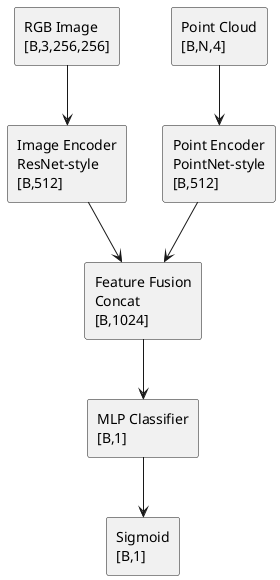

# 网络拓扑图绘制指南

## 🎯 网络架构可视化方案

### 方案A: 详细架构图（推荐用于论文）

```
┌─────────────────────────────────────────────────────────────────┐
│          输入层 (Input Layer)                                       │
├─────────────────────────────────────────────────────────────────┤
│                                                                   │
│   ┌──────────────┐              ┌──────────────┐                │
│   │  RGB Image   │              │ Point Cloud  │                │
│   │ [B,3,256,256]│              │  [B,N,4]     │                │
│   └──────┬───────┘              └──────┬───────┘                │
│          │                              │                        │
└──────────┼──────────────────────────────┼────────────────────┘
           │                              │
           │                              │
┌──────────┼──────────────────────────────┼────────────────────┐
│          │                              │                    │
│          ▼                              ▼                    │
│   ┌──────────────────┐          ┌──────────────────┐          │
│   │  Image Encoder   │          │  Point Encoder   │          │
│   │  (ResNet-style)  │          │  (PointNet-style)│          │
│   │                  │          │                  │          │
│   │ Conv2d(3→64)     │          │ Conv1d(4→64)     │          │
│   │ ResBlock×3       │          │ Conv1d(64→128)   │          │
│   │ (64→128→256→512) │          │ Conv1d(128→256) │          │
│   │ Global Avg Pool  │          │ Conv1d(256→512)  │          │
│   │                  │          │ Max Pool        │          │
│   └────────┬─────────┘          └────────┬─────────┘          │
│            │                              │                    │
│            │ [B, 512]                     │ [B, 512]          │
│            │                              │                    │
└────────────┼──────────────────────────────┼────────────────────┘
             │                              │
             │                              │
┌────────────┼──────────────────────────────┼────────────────────┐
│            │                              │                    │
│            ▼                              ▼                    │
│     ┌──────────────────────────────────┐                     │
│     │   Feature Fusion Layer          │                     │
│     │   (Cross-Modal Fusion)           │                     │
│     │                                   │                     │
│     │   [Image Feat] ──┐               │                     │
│     │                  ├─→ Concat       │                     │
│     │   [Point Feat] ──┘               │                     │
│     │                                   │                     │
│     │   Output: [B, 1024]              │                     │
│     └─────────────┬─────────────────────┘                     │
│                   │                                            │
└───────────────────┼────────────────────────────────────────────┘
                    │
                    ▼
┌─────────────────────────────────────────────────────────────────┐
│          分类头 (Classification Head)                             │
├─────────────────────────────────────────────────────────────────┤
│                                                                   │
│   ┌─────────────────────────────────────┐                       │
│   │  MLP Classifier                     │                       │
│   │                                      │                       │
│   │  Linear(1024 → 512)                 │                       │
│   │  ReLU + Dropout(0.5)                │                       │
│   │  Linear(512 → 256)                  │                       │
│   │  ReLU + Dropout(0.3)                 │                       │
│   │  Linear(256 → 1)                    │                       │
│   │                                      │                       │
│   └──────────────┬──────────────────────┘                       │
│                  │                                               │
│                  ▼                                               │
│          ┌──────────────┐                                        │
│          │   Sigmoid    │                                        │
│          └──────┬───────┘                                        │
│                 │                                                │
│                 ▼                                                │
│          [B, 1] Anomaly Probability                             │
│                                                                   │
└─────────────────────────────────────────────────────────────────┘
```

### 方案B: 简化流程图（用于快速理解）

```
Input Data
    │
    ├─→ [RGB Image] ──→ Image Encoder ──→ [512D Features]
    │                                          │
    │                                          ├─→ Fusion
    └─→ [Point Cloud] ──→ Point Encoder ──→ [512D Features] ──┘
                                                   │
                                                   │
                                                   ▼
                                            [1024D Fused]
                                                   │
                                                   ▼
                                            Classifier MLP
                                                   │
                                                   ▼
                                            [Anomaly Score]
```

### 方案C: 数据维度变化图（技术细节）

```
维度变换流程：

阶段1: 输入
├── Image:    [B, 3, 256, 256]   (Batch × RGB × Height × Width)
└── Points:   [B, N, 4]           (Batch × Points × Features)

阶段2: 特征提取
├── Image:    [B, 3, 256, 256]
│              ↓ (Conv2d + ResBlocks)
│              [B, 512, 8, 8]
│              ↓ (Global Avg Pool)
│              [B, 512]
│
└── Points:   [B, N, 4]
               ↓ (Conv1d × 4)
               [B, 512, N]
               ↓ (Max Pool)
               [B, 512]

阶段3: 融合
├── Image Feat:  [B, 512]
└── Point Feat:  [B, 512]
    ↓ (Concat)
    [B, 1024]

阶段4: 分类
[B, 1024]
    ↓ (Linear × 3)
    [B, 1]

阶段5: 输出
[B, 1] → Sigmoid → [B, 1] (Probability ∈ [0,1])
```

## 📐 绘制工具推荐

### 1. Draw.io (推荐⭐⭐⭐)
- 网址: https://app.diagrams.net/
- 优点: 免费、在线、支持导出多种格式
- 模板: 使用"Flowchart"模板

### 2. PlantUML (代码绘制)


### 3. PowerPoint / Keynote (快速绘制)
- 使用SmartArt图形
- 选择"流程"模板

### 4. Python + Graphviz (代码生成)
```python
from graphviz import Digraph

dot = Digraph(comment='Anomaly Detection Network')
dot.node('img', 'RGB Image\n[B,3,256,256]')
dot.node('pc', 'Point Cloud\n[B,N,4]')
dot.node('img_enc', 'Image Encoder\n[B,512]')
dot.node('pc_enc', 'Point Encoder\n[B,512]')
dot.node('fusion', 'Fusion (Concat)\n[B,1024]')
dot.node('classifier', 'MLP Classifier\n[B,1]')
dot.node('output', 'Anomaly Score\n[B,1]')

dot.edges([('img', 'img_enc'), ('pc', 'pc_enc'),
           ('img_enc', 'fusion'), ('pc_enc', 'fusion'),
           ('fusion', 'classifier'), ('classifier', 'output')])

dot.render('network_topology', format='png')
```

## 🎨 设计要点

### 颜色方案建议
- **输入层**: 蓝色系
- **特征提取**: 绿色系  
- **融合层**: 橙色系（核心创新）
- **分类层**: 红色系
- **输出层**: 紫色系

### 标注规范
- 每个模块标注：**功能名称** + **维度变化**
- 关键操作用特殊符号标注：⊗ (融合), ↓ (池化), → (变换)
- 维度用方括号标注：[B, C, H, W]

### 完整示例标注

```
Image Encoder (ResNet-style)
├── Conv2d(3→64, k=7, s=2)     → [B, 64, 128, 128]
├── ResBlock(64→128, ×2)      → [B, 128, 64, 64]
├── ResBlock(128→256, ×2)      → [B, 256, 32, 32]
├── ResBlock(256→512, ×2)   → [B, 512, 8, 8]
└── Global Avg Pool            → [B, 512]
```

## 📝 论文中使用的建议

### Figure 1: 整体架构图
- 使用方案A（详细架构图）
- 突出**双分支特征提取** + **融合**的结构
- 标注关键创新点

### Figure 2: 数据流图
- 使用方案C（维度变化图）
- 展示数据从输入到输出的完整变换

### 补充说明
- 在图中用虚线框标注"可训练模块"和"冻结模块"
- 用特殊颜色标注"核心创新"部分

---

**生成日期**: 2025-01-XX  
**适用版本**: 场景级异常检测模型 (SceneLevelAnomalyDetector)


